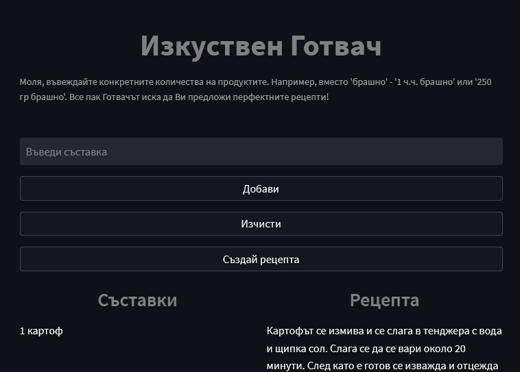

# Chef GPT
GPT-2 architecture trained to generate recipes based on either ingredients or recipe name.

## Model description
This is GPT-2 trained on a custom dataset of recipes in `Bulgarian`. You can find the dataset [here](https://www.kaggle.com/datasets/auhide/bulgarian-recipes-dataset).
The model is published on HuggingFace's Model Hub with ID [`auhide/chef-gpt`](https://huggingface.co/auhide/chef-gpt).

## Website

    <a href="https://chef-gpt.streamlit.app/" target="_blank">
        

    </a>

You can visit the website by clicking [here](https://chef-gpt.streamlit.app/).
